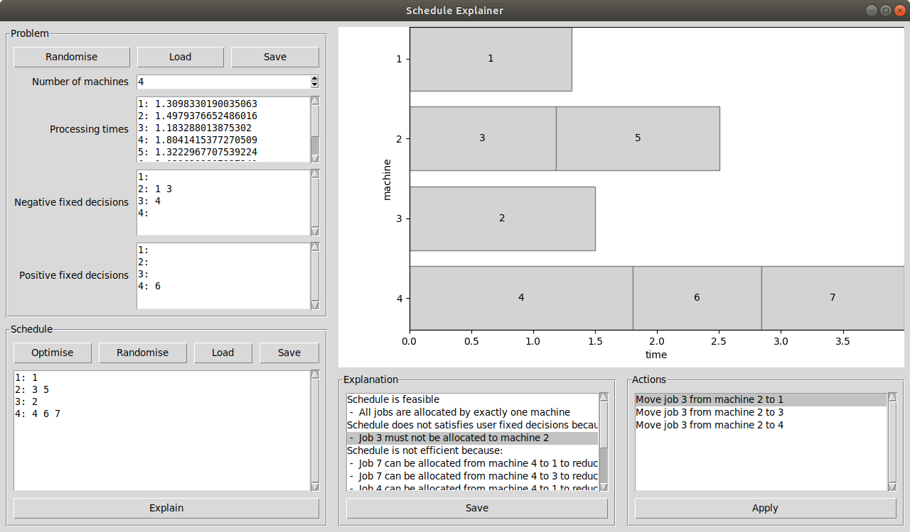
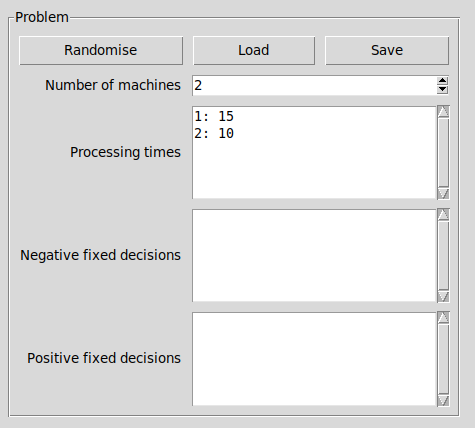

# ArgOpt

## A tool for explainable [makespan scheduling](https://en.wikipedia.org/wiki/Schedule) using [abstract argumentation frameworks](https://en.wikipedia.org/wiki/Argumentation_framework), 
as proposed and described in the research paper [Argumentation for Explainable Scheduling](https://www.aaai.org/ojs/index.php/AAAI/article/view/4126)

Figure: Tool GUI showing problem and schedule input and explanation output

## Installation

The tool runs on [Python3](https://www.python.org/downloads/).

Requirements:

- [GLPK](https://www.gnu.org/software/glpk/) 
- `pip3 install matplotlib`
- `pip3 install pillow`
- `pip3 install pyomo`

### Ubuntu

- `apt install glpk-utils`
- `apt install python-glpk`

### Mac

- `brew install glpk`

### Windows

- get GLPK, add it to PATH (environment variables)

## How to use the tool

In `src/` run `python3 main.py -g`

Figure: Example problem input

- Machines are indexed by integers 1, 2, 3, ...
- Jobs are indexed by capital letters A, B, C, ...
- Job processing times are floats
- Negative fixed decisions impose which machines cannot do which jobs
- Positive fixed decisions impose which machines must do which jobs

***

- The \texttt{Optimise} button finds the optimal schedule using a solver, which is by default GLPK. 
To specify a solver, starting the tool with `python3 main.py -g -S SOLVER_NAME` where `SOLVER\_NAME` is GLPK or CPLEX, for instance. Note that for large problems, optimisation may take a long time, so a solver time limit can be enforced by starting the tool with `python3 main.py -g -t TIME\_LIMIT` where `TIME\_LIMIT` is in seconds. 
- The `Randomize` button generates some feasible schedule, which may violate fixed decisions. 
- To explain the schedule, click the `Explain` button.

***

Explanations pertain to feasibility, satisfaction of fixed decisions and efficiency. 
Feasibility ensures that each job is allocated once. Satisfaction of fixed decisions ensures the schedule satisfies fixed decisions. 
Efficiency amounts to at most 4/3 of the optimal makespan. 
Explanations are ordered in order of decreasing makespan improvements. 
To improve the schedule, select a line in the explanation listbox to address, then select a line in the actions listbox and click the `Apply` button.

The dot-highlighted boxes in the cascade chart illustrate newly and removed allocations compared to before the applying the action.
